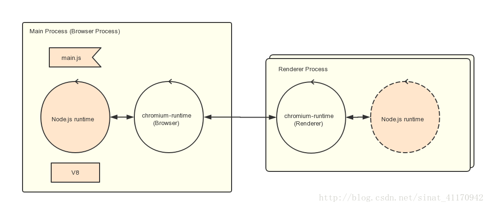
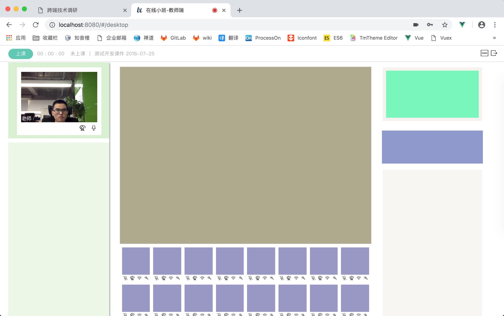
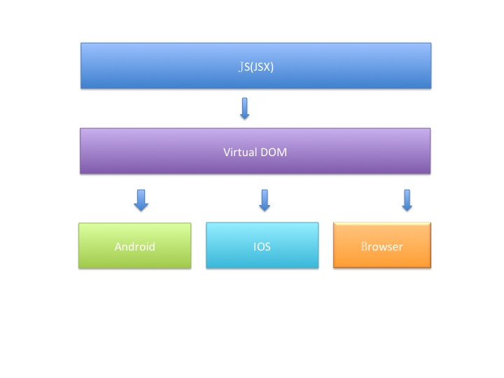
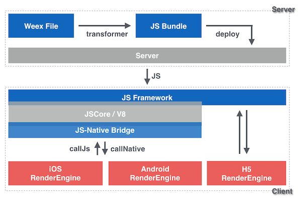

# H5跨端技术调研

## 一、几个概念

Native App、Web App、Hybrid、React Native 和 Weex

#### 1、Native App

  传统的原生App开发模式，有 iOS 和 Android 两大系统，需要各自语言开发各自App

#### 2、Web App

  H5应用，泛指 SPA(Single Page Application)，运行在浏览器中

#### 3、Hybrid

混合模式移动应用，介于Web App、Native App这两者之间的App开发技术，兼具“Native App良好交互体验的优势”和“Web App跨平台开发的优势”（百度百科解释）

- 基本原理是：

Native <--> JSBridge  <--> H5，页面在 Webview 中显示，

Android、iOS 的 API 一般有一致性，Hybrid App 所以有跨平台效果

#### 4、React Native

Facebook 2015 年发明、采用使用 JSX 语言写原生界面，通过 JSBridge 调用原生 API，渲染 DOM，流行度很高

#### 5、Weex

阿里巴巴，2016年4月正式开源，支持Vue.js，刚起步，阿里内部使用

## 二、Native APP、hybrid App、WebApp 的优缺点对比

H5 开发的 web APP 和原生 APP 的区别有以下几个方面：

### 一. 原生APP

目前市场上大多数的APP都是使用原生开发的，基本没有兼容性问题。

#### 优点：

- 1、直接下载，方便快捷，省时省力

- 2、用户体验度最高，并且缓存速度快，性能好

- 3、要审核，APP质量和安全性好

- 4、可调用手机里的摄像头，GPS定位，通讯录、短信、蓝牙等

#### 缺点：

- 1、原生开发APP费用高，维护起来比较繁琐

- 2、APP使用内容限制，因为一般APP商店或者安卓应用市场上会对APP上线审核的内容有所限制

- 3、上线时间不确定，APP应用审核时间长短不一

### 二. 混合APP

混合模式发的APP就是Hybrid APP，混合模式开发的APP是介于原生APP和web APP之间的，百度、美团都在用

#### 优点：

- 1、不需要安卓和ios两拨人进行开发，节省开发费用，缩短开发周期

- 2、可以跨平台使用，编写一次核心代码就可以部署到多个平台

- 3、兼容多平台，可以随意调整排版布局等

#### 缺点：

- 1、性能不稳定

- 2、兼容性比较差

- 3、用户体验较差（不如原生APP）

- 4、目前技术不太成熟

### 三. web APP

Web APP是基于web的系统和应用，用框架构成，一般使用h5+APP的模式，Web App就是运行于网络和标准浏览器上，基于网页技术开发实现特定功能的应用。

#### 优点：

- 1、项目独立，可以运行到浏览器。

- 2、跨平台的开发工具，多样化。

- 3、控制版本比较容易。

- 4、开发成本低，更新快。

#### 缺点：

- 1、临时性入口，搜索web APP比较困难。

- 2、质量和安全性比较差

- 3、用户体验差，留存率低。

## 三、主流跨端技术

### 1、PC 桌面应用

#### Electron

> 使用 JavaScript, HTML 和 CSS 构建跨平台的桌面应用

## 原理

### 2、CEF

> Chromium Embedded Framework (CEF)是个基于 Google Chromium 项目的开源 Web browser 控件，支持Windows, Linux, Mac平台
 
#### 特点

- 1、基于Chromium，CEF（3）支持HTML5的特性

- 2、并且在性能上面，也比较接近Chrome

- 3、自定义插件、自定义协议

- 4、自定义JavaScript对象和扩展

#### 典型应用

- 某课

<!--  -->

- 直播云
                                                                                            
 基于 cef 做定制封装形成 libcef，支持 Windows、Linux、Mac

### 2、移动 App

#### React Native

口号：learn once, run everywhere
构建真正 Native 的应用。不同于传统 Hybrid 框架，React Native完全脱离 WebView 进行开发，因为它挣脱了复杂的DOM，高效率渲染、流畅交互使用户体验得到非常多的提升。

它能使用够使用同样的语言同时支持iOS、Android平台，减少了我们在跨平台开发时对Native语言的不熟悉而产生的障碍。

#### 原理

#### 优点

- 相对于基于Web开发的hybrid框架，渲染效率、交互流畅度有明显提高

- 使用相同的语言开发便能同时开发iOS、Android

#### 缺点

 - 学习成本较高 (react 和 native)
 
 - 需要了解原生平台的相关特性、通信机制、渲染差异
 
 - 数据量很大渲染时，会造成内存损耗
 
#### Weex

阿里产
口号：Write once, run everywhere
解决跨平台的适配问题，同时，又拥有着Native原生App的性能问题。
使用群体：阿里系产品

#### 原理

#### 优点

 - 1、采用 web 语言作为基础开发语言，降低学习成本

 - 2、轻量，分模块加载，
 
 - 3、支持vue，开发便捷
 
 - 4、跨平台，不需要些端适配代码

#### 缺点

- 1、文档落后，网上资料不全，社区不成熟

- 2、主要是阿里系使用，市面上未大规模使用

- 3、扩展性已经性能方面有待证明

- 4、H5 标签支持较少

## 四、结论

- 1、桌面端可采用 CEF

- 2、移动端先Native，并逐步过渡到 React Native（react native + 原生直播）

- 3、根据业务场景，使用 Native 与 h5 结合方式

